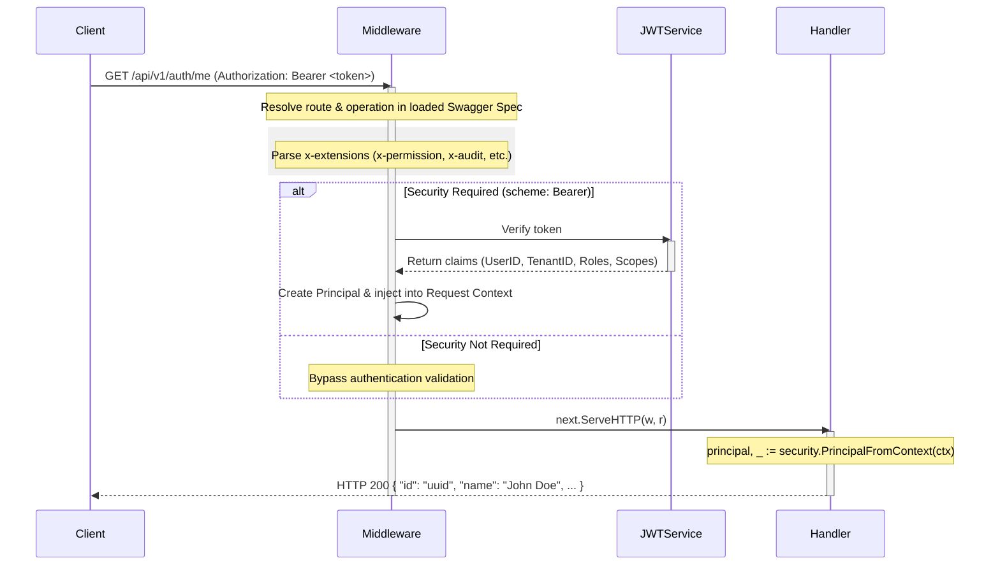

# go-backend-chi-openapi

A production-ready, clean architecture Go backend template powered by Chi Router and OpenAPI (oapi-codegen), featuring a declarative spec-driven security & middleware engine.

---

## 🚀 Key Architectural Pillars

### 1. Spec-First & Type-Safe Code Generation
The API contract is defined in modular OpenAPI 3.1.0 specifications under `api/openapi/v1/`. We use `oapi-codegen` to automatically compile this contract into type-safe Go server routes, request/response models, and interfaces (`api.gen.go`). This guarantees that your code always aligns with the documentation.

### 2. Spec-Driven Security & Authorization Engine (`pkg/security`)
Instead of manually hardcoding and wiring authentication or permission middlewares for every handler, the security system resolves policies **dynamically at runtime directly from the OpenAPI spec** using the `kin-openapi` router:
- **Automatic Auth Validation**: If an operation specifies `security: - BearerAuth: []` in the OpenAPI YAML, the middleware automatically requires and validates a Bearer token.
- **Custom Declarative Extensions**: Handlers can read custom OpenAPI extension properties defined directly inside the OpenAPI operation spec, such as:
  - `x-permission`: Map module, resource, and action (e.g. `auth:me:read`) for RBAC checks.
  - `x-data-scopes`: Finely-grained scopes (e.g. `user:read`).
  - `x-audit`: Declarative audit logging policy.
  - `x-step-up-mfa`: Step-Up multi-factor authentication check requirements.
- **Unified Middleware**: A single middleware (`securityMiddleware.Security`) is applied globally to the API route group. It extracts request details, finds the corresponding route in Swagger, validates credentials, and injects a unified identity `Principal` into the request context.

---

## 📁 Directory Structure

```text
├── api/
│   └── openapi/
│       └── v1/
│           ├── components/     # Reusable request/response components
│           ├── paths/          # Modular Swagger endpoint routes
│           ├── schemas.yaml    # Reusable Swagger schema definitions
│           ├── openapi.yaml    # Swagger entrypoint specification
│           ├── _bundled.yaml   # Bundled specification (for Swagger UI)
│           └── generated/
│               └── api.gen.go  # Code generated by oapi-codegen
├── cmd/                        # App entrypoints
├── config/                     # Configuration and env loader (godotenv)
├── internal/                   # Private domain modules
│   ├── auth/                   # Authentication domain handlers & business logic
│   ├── health/                 # Health check domain handlers
│   └── server/                 # Orchestrates/embeds sub-handlers to implement ServerInterface
├── pkg/                        # Reusable public packages
│   ├── httpx/                  # Custom HTTP response utilities
│   ├── observer/               # Chi Logger and Recoverer wrapper middlewares
│   ├── pointerx/               # Type-safe generic helpers for pointer conversions
│   └── security/               # The Spec-Driven Security & Authorization engine
├── scripts/                    # Helper tooling scripts (e.g. genapi.sh for code gen)
├── main.go                     # Application wiring and server entrypoint
└── go.mod                      # Dependency management
```

---

## 🛡️ Spec-Driven Security Flow



---

## 🛠️ How to Run & Develop

### 1. Prerequisites
- Go 1.26.5+ Installed
- Node.js (for redocly spec bundling)

### 2. Generate OpenAPI Server Code
Whenever you modify files in `api/openapi/v1/`, run the generation script to bundle the spec and regenerate `api.gen.go`:
```bash
chmod +x ./scripts/genapi.sh
./scripts/genapi.sh
```

### 3. Run the Server
Start the development server with hot-reload (if using `air`) or standard go:
```bash
# Using Air (recommended)
air

# Or using standard Go
go run main.go
```
The server will start running on port `8000`.

---

## 📝 API Testing Examples

### 1. View Swagger UI Docs
Open your browser and navigate to:
```text
http://localhost:8000/api/v1/docs
```

### 2. Public Endpoint (Status Check)
```bash
curl -X 'GET' 'http://localhost:8000/api/v1/status' -H 'accept: application/json'
```

### 3. Secure Endpoint (Get Me) - Missing Token (HTTP 401)
```bash
curl -X 'GET' 'http://localhost:8000/api/v1/auth/me' -H 'accept: application/json'
```
Response:
```json
{
  "type": "about:blank",
  "title": "UNAUTHORIZED",
  "status": "401"
}
```

### 4. Secure Endpoint (Get Me) - Successful Request (HTTP 200)
```bash
curl -X 'GET' \
  'http://localhost:8000/api/v1/auth/me' \
  -H 'accept: application/json' \
  -H 'Authorization: Bearer my-secret-token'
```
Response:
```json
{
  "id": "00000000-0000-0000-0000-000000000001",
  "name": "John Doe",
  "email": "jhon.dow@mail.com"
}
```

### 5. Middleware & Security Verification Check Endpoints
We have check endpoints mapped with specific OpenAPI security extensions (`x-permission`, `x-data-scopes`, `x-audit`, and `x-step-up-mfa`) to verify their runtime execution:

#### RBAC Permission Verification (`x-permission`)
- **Passed (HTTP 200)**:
  ```bash
  curl -X 'GET' 'http://localhost:8000/api/v1/check/rbac' \
    -H 'Authorization: Bearer my-secret-token'
  ```
- **Forbidden (HTTP 403)**:
  ```bash
  curl -X 'GET' 'http://localhost:8000/api/v1/check/rbac' \
    -H 'Authorization: Bearer no-permission-token'
  ```

#### Data Scopes Verification (`x-data-scopes`)
- **Passed (HTTP 200)**:
  ```bash
  curl -X 'GET' 'http://localhost:8000/api/v1/check/scopes' \
    -H 'Authorization: Bearer my-secret-token'
  ```
- **Forbidden (HTTP 403)**:
  ```bash
  curl -X 'GET' 'http://localhost:8000/api/v1/check/scopes' \
    -H 'Authorization: Bearer no-permission-token'
  ```

#### Step-Up MFA Verification (`x-step-up-mfa`)
- **Passed (HTTP 200)**:
  ```bash
  curl -X 'GET' 'http://localhost:8000/api/v1/check/mfa' \
    -H 'Authorization: Bearer mfa-token'
  ```
- **Forbidden (HTTP 403)**:
  ```bash
  curl -X 'GET' 'http://localhost:8000/api/v1/check/mfa' \
    -H 'Authorization: Bearer my-secret-token'
  ```

#### Audit Logging Verification (`x-audit`)
- **Passed (HTTP 200 with audit tag)**:
  ```bash
  curl -X 'GET' 'http://localhost:8000/api/v1/check/audit' \
    -H 'Authorization: Bearer my-secret-token'
  ```
  Check the server console for the generated log:
  ```text
  [AUDIT] Authenticated endpoint accessed: GET /api/v1/check/audit (User: 00000000-0000-0000-0000-000000000001, Operation: CheckAudit)
  ```

